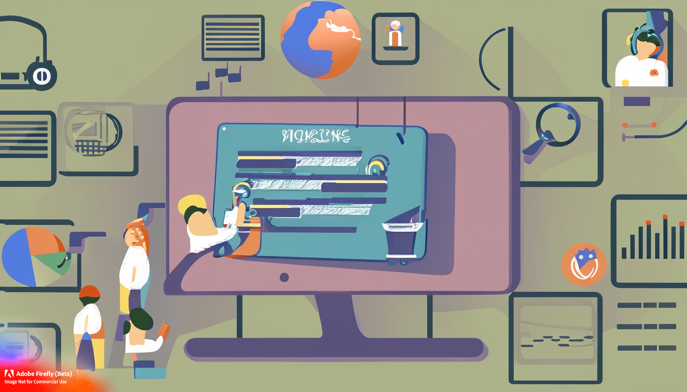
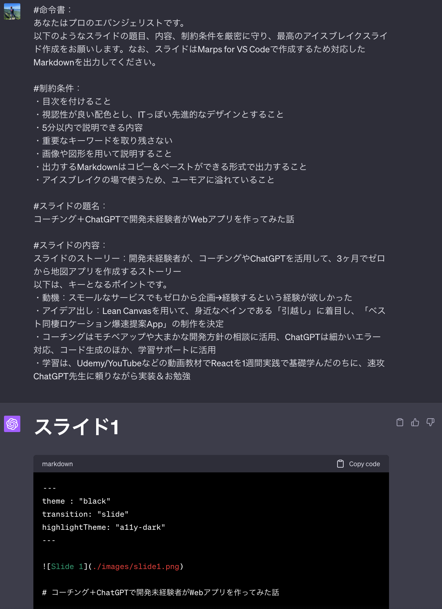
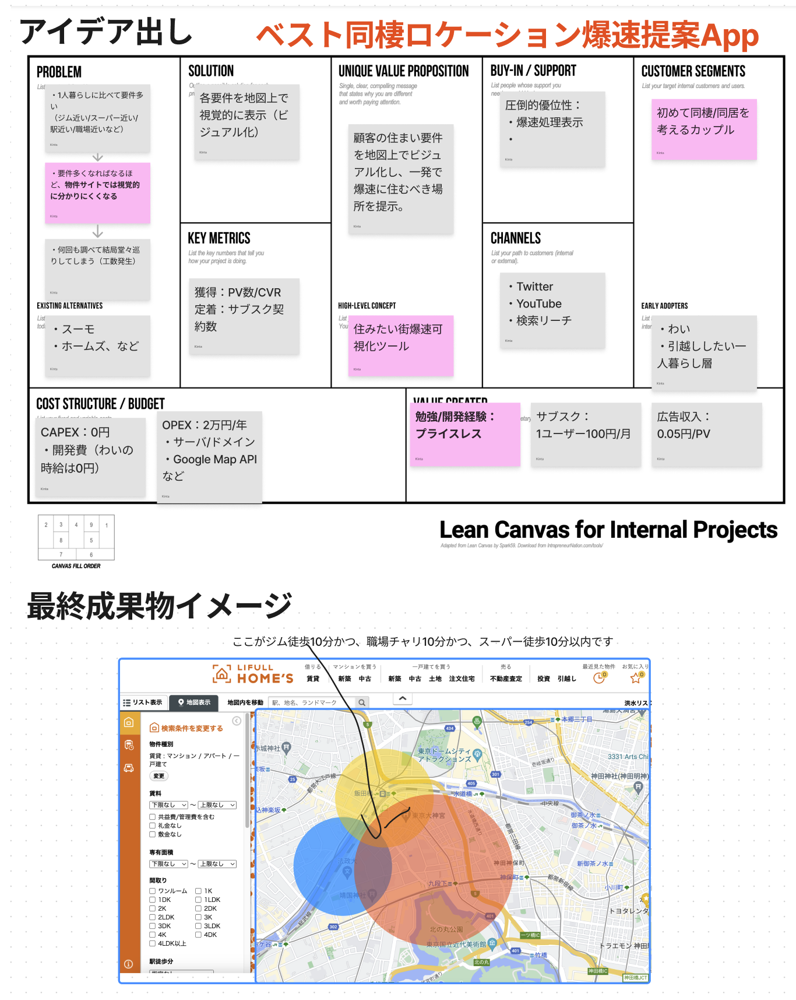
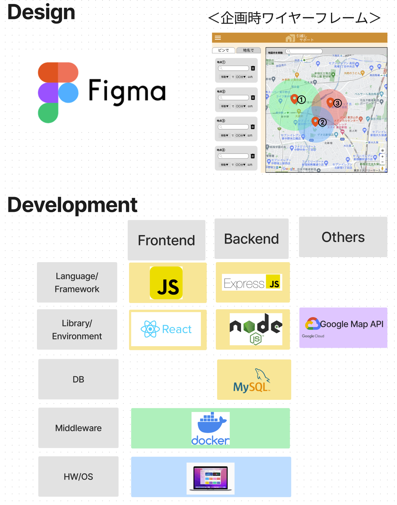

# 開発未経験エンジニアが **_コーチング_** × **_ChatGPT_** で **ゼロ**から **Web アプリ**を作ってみた話

<!-- - ある日のエバンジェリストの冒険 -->

---

## 目次

1. 動機
2. コーチングと ChatGPT
3. アイデア出し
4. 学習と実装
5. 結果と反省

---

## 1. 動機

- 本業の課題：企画や要件定義、作業指示がフワッとしている、説得力がない！
  👇
- 開発未経験すぎて、腹落ちできてないからじゃないか説！
  👇
- スモールな Web アプリでも 1 人で 0 から企画 → 開発までやりきる経験が欲しい！

---

## 2. コーチングと ChatGPT

### 期間は 3 ヶ月、毎週 10 時間程度投下

- コーチング：モチベ維持や大まかな開発方針の相談
- ChatGPT：エラー対応、コード生成の他、学習サポートも

### 3 ヶ月のおおまかな流れ

- アイデア出し ➡️UI デザイン ➡️ 学習 ➡️ 実装

---

## 3. アイデア出し

- Lean Canvas を用いて、身近なペインである「引越し」に着目
- 「ベスト同棲ロケーション爆速提案 App」の制作を決定

---

## 4. 学習と実装

- UI デザイン/Javascript 全て初学習
- Udemy/YouTube 等の動画教材で全力勉強
- 以降 ChatGPT 先生に頼りながら実装

---

## 5. 結果と反省

- ゼロスタートでも 3 ヶ月で企画 ⇨ 学習 ⇨ 実装なんとかなる、総じて良い成功体験
- DB 接続、API エンドポイント定義/コールなどモジュール間の連携系に沼った
- とはいえモチベ維持が最大の敵
- ChatGPT は偉大
